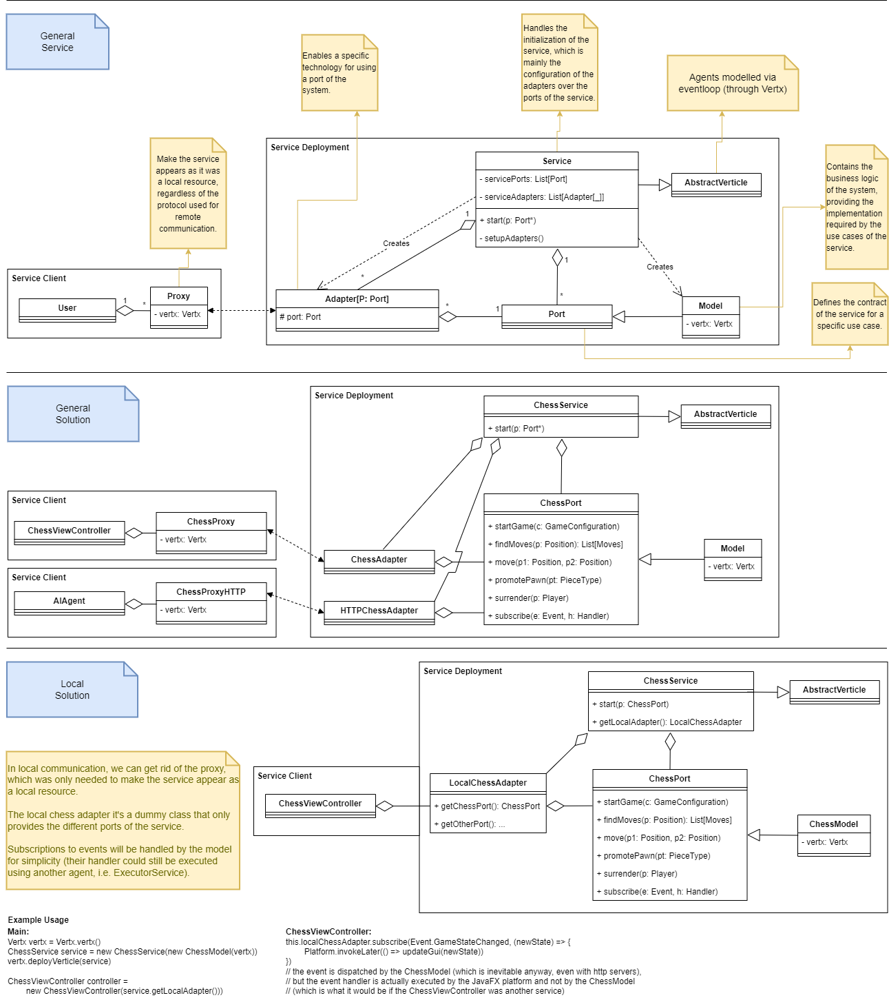
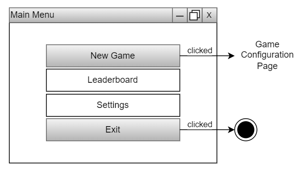
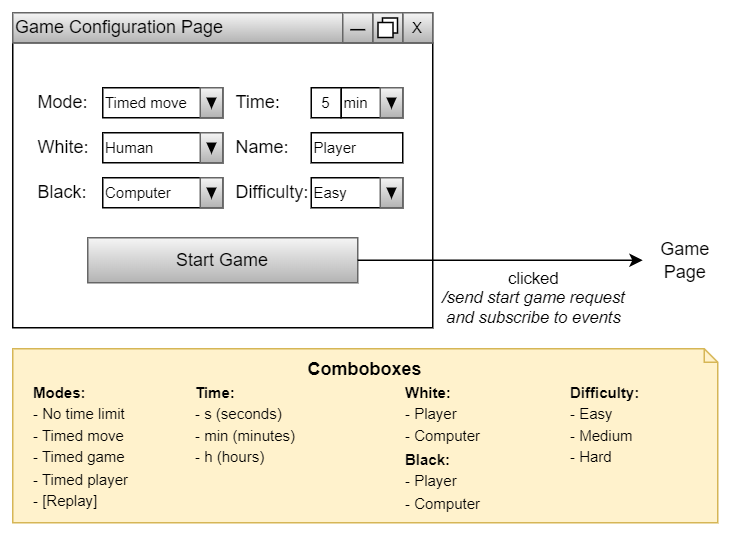
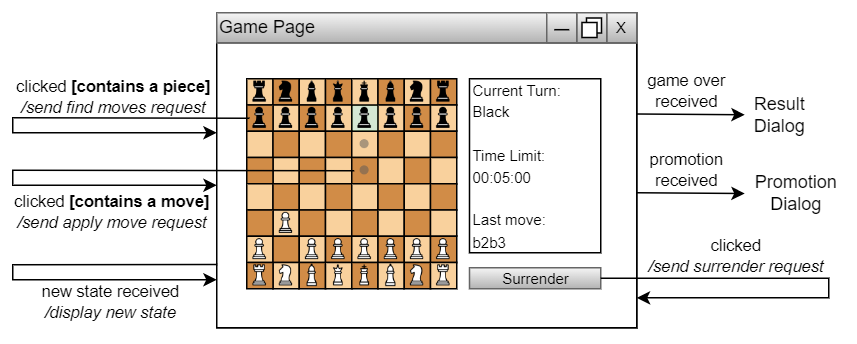
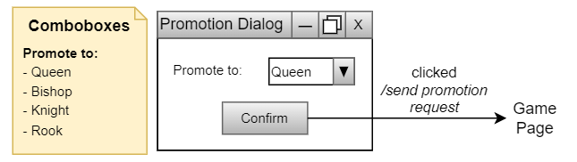
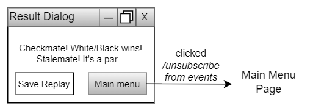

# Design Architetturale

Per quanto riguarda il design architetturale del sistema si identificano due macro-componenti principali,
i quali vengono suddivisi a loro volta in altri sotto-componenti:
- _Engine_: gestisce la creazione e lo sviluppo di una partita degli scacchi.
  È stato realizzato come servizio, seguendo un'architettura di tipo esagonale,
  anche conosciuta come _ports & adapters_, allo scopo di facilitarne la
  composizione con altri servizi. In particolare, l'architettura prevede i seguenti componenti:
  - _Modello_: definisce la _business logic_ del sistema.
  - _Porta_: espone le funzionalità del modello in rapporto a uno specifico caso d'uso del servizio.
  - _Adapter_: permette l'interazione con una specifica porta attraverso una specifica tecnologia.
- _Applicazione_: gestisce l'interazione dell'utente col servizio. In particolare, è composto da:
  - _Proxy_: media l'interazione tra l'applicazione e l'engine al fine di proteggere l'utilizzatore dai
    cambiamenti del servizio.
  - _ViewController_: gestisce l'interazione tra utente e l'applicazione.

Di seguito, si riporta l'architettura del sistema nella sua forma più generale, in cui l'engine può
includere modelli, porte e adapter diversi.

Per lo scopo di questo progetto, è possibile semplificare l'architettura considerando semplicemente il flusso 
d'informazioni tra l'applicazione e l'engine.

## Engine

Per esplicitare i vari casi d'uso, il contratto del servizio prevede le seguenti funzionalità:
- _Ottenimento dello stato del gioco corrente_: funzionalità che permette di ottenere lo stato della scacchiera, lo 
  storico delle mosse compiute, il turno del giocatore corrente e la configurazione della partita.
- _Avvio della partita_: funzionalità che, a partire da una data configurazione, permette di avviare 
  una partita.
- _Ottenimento delle possibili mosse_: funzionalità che, a partire da una posizione su una scacchiera, trova tutte le 
  possibili mosse.
- _Applicazione di una mossa_: funzionalità che applica una specifica mossa alla partita.
- _Promozione_: funzionalità che, a partire da una posizione e da un tipo di pezzo, promuove il pedone in tale posizione
  al pezzo specificato.
- _Resa_: funzionalità che permette al giocatore di turno di arrendersi.

In seguito all'applicazione delle varie funzionalità, vengono creati determinati eventi, ai quali è possibile 
sottoscriversi:
- _GameOverEvent_: evento generato per avvisare l'utente che la partita è terminata. Esso può essere
  generato in più momenti: quando un giocatore subisce lo scacco matto, quando il giocatore di turno non ha 
  mosse disponibili (stallo), quando un giocatore si arrende oppure allo scadere del tempo, nel caso in cui la 
  partita sia stata impostata con un vincolo temporale.
- _TimePassedEvent_: evento generato per avvisare l'utente che è trascorso del tempo, nel caso in cui
  la partita sia stata impostata con un vincolo temporale.
- _BoardChangedEvent_: evento generato per avvisare l'utente che la scacchiera è stata modificata.
- _TurnChangedEvent_: evento generato per avvisare l'utente che il controllo del gioco è passato a un altro giocatore.
- _PromotingPawnEvent_: evento generato per avvisare l'utente che un pedone deve essere promosso.
- _CheckNotificationEvent_: evento generato quando si individua una situazione di scacco sulla scacchiera.

L'engine è un servizio _stateful_, per cui possiede uno stato che viene modificato in base alle richieste ricevute dagli
utenti. In base a tale stato, le funzionalità esposte dal contratto possono essere abilitate o disabilitate, secondo il
seguente diagramma degli stati.

Quando il servizio viene avviato, si trova nello stato _Engine Started_, in cui diventa possibile richiedere il suo 
stato o sottoscriversi ai suoi eventi.

Inizialmente, il servizio si trova nello stato _Game Not Configured_, in cui la partita gestita dal servizio non è 
configurata. In tale stato, il servizio è in attesa che un utente cominci una nuova partita configurandola.

Una volta cominciata, il servizio entra nello stato _Game Running_, in cui la partita è in esecuzione. In tale stato, 
è possibile richiedere al servizio le mosse di un certo pezzo sulla scacchiera, muovere un pezzo della scacchiera o 
arrendersi.
Se un utente notifica il servizio di volersi arrendere, il servizio termina la partita ritornando nello stato 
_Game Not Configured_.
Invece, se un utente notifica il servizio di una certa mossa da eseguire, il servizio la esegue se è una mossa che coinvolge
uno dei pezzi del giocatore di turno.

Una volta specificata la mossa da eseguire, se un pedone dell'utente ha raggiunto la base avversaria, il servizio entra
nello stato _Game Awaiting Promotion_, in cui si mette in attesa che il giocatore di turno invii una nuova richiesta per
promuovere il pedone ad un certo pezzo. In ogni altro caso, la partita procede normalmente ed il controllo della
scacchiera passa al giocatore successivo.

Solo nello stato _Game Awaiting Promotion_, è possibile richiedere al servizio di promuovere un pedone. Quando ciò
accade il controllo della scacchiera passa al giocatore successivo.

## Applicazione

L'applicazione prevede quattro schermate principali, presentati nei seguenti mockup.
Per estendibilità, i mockup sono stati realizzati considerando anche i requisiti opzionali.

### Main Menu Page

Nella schermata raffigurata, sono presenti quattro pulsanti:
- _New Game_: quando premuto, visualizza la pagina di configurazione della partita.
- _Leaderboard_: quando premuto, visualizza la pagina della classifica dei giocatori.
- _Settings_: quando premuto, visualizza la pagina per le impostazioni grafiche dell'applicazione.
- _Exit_: quando premuto, termina l'applicazione.

### Game Configuration Page

Nella schermata seguente, sono presenti vari controlli per permettere di configurare la partita, impostando diversi 
parametri, come vincoli temporali, modalità di gioco, nomi dei giocatori, difficoltà dell'_AI_.

Premendo il pulsante _Start Game_, viene visualizzata la pagina della partita, dopo aver richiesto l'avvio della 
partita all'engine.

### Game Page

In questa schermata, viene rappresentato lo stato corrente del gioco, di cui viene principalmente mostrata la 
scacchiera di gioco, la quale contiene tutti i pezzi attualmente disponibili.

Inoltre, vengono visualizzati il turno corrente, il tempo rimanente al giocatore di turno e l'ultima mossa
effettuata, i quali vengono mantenuti aggiornati in relazione agli eventi generati dall'engine.

In quest'interfaccia, è possibile selezionare una casella della scacchiera per due scopi diversi:
- Visualizzazione delle mosse possibili del pezzo selezionato
- Applicazione di una delle mosse visualizzate

Entrambe dipendono dalle rispettive funzionalità dell'engine.

Infine, è presente anche un pulsante di resa che, in seguito al comando appropriato all'engine, comporta l'immediata
sconfitta del giocatore di turno.

Quando l'interfaccia viene notificata della avvenente promozione di un pedone, viene visualizzata la finestra di 
scelta del pezzo in cui promuoverlo.

Quando l'interfaccia viene notificata della terminazione della partita da parte dell'engine, viene visualizzata la
finestra di risultato della partita.

### Promotion Dialog

Tale finestra permette di scegliere il pezzo al quale si vuole promuovere il pedone. 

Alla pressione del pulsante _Confirm_, viene richiesto all'engine di completare la 
promozione del pedone in base alla propria scelta.

### Result Dialog

Tale finestra contiene il risultato finale della partita, il quale indica la causa della terminazione e un messaggio
contenente ulteriori dettagli.

Alla pressione del pulsante _Save Replay_, sarà richiesto all'utente dove desidera salvare il file contenente il
replay della partita appena giocata.

Alla pressione del pulsante _Main Menu_, viene visualizzata la schermata principale dell'applicazione.

## Scelte Tecnologiche

Per la realizzazione del sistema, non saranno necessarie delle tecnologie specifiche, ma sicuramente
sarà necessaria una tecnologia per l'interfaccia grafica.
Inoltre, allo scopo di rendere il progetto predisposto a una modalità distribuita, è necessario un'ulteriore tecnologia 
che permetta all'engine di essere asincrono e reattivo.

[Back to index](../index.md) |
[Previous Chapter](../3-requirements/index.md) |
[Next Chapter](../5-detailed-design/index.md)
