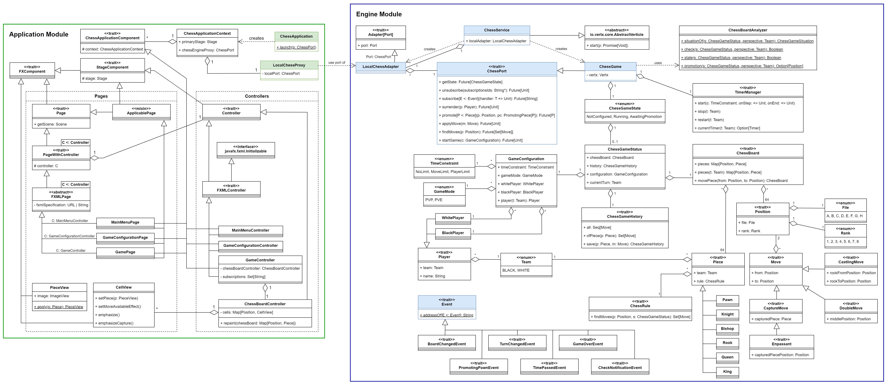
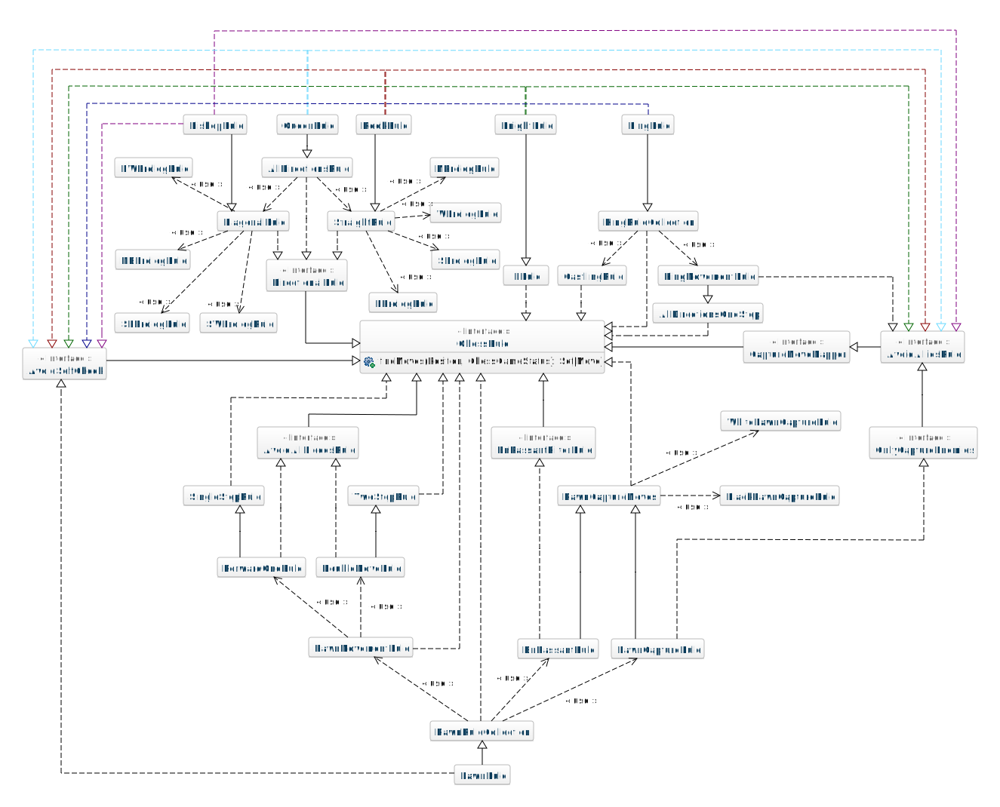
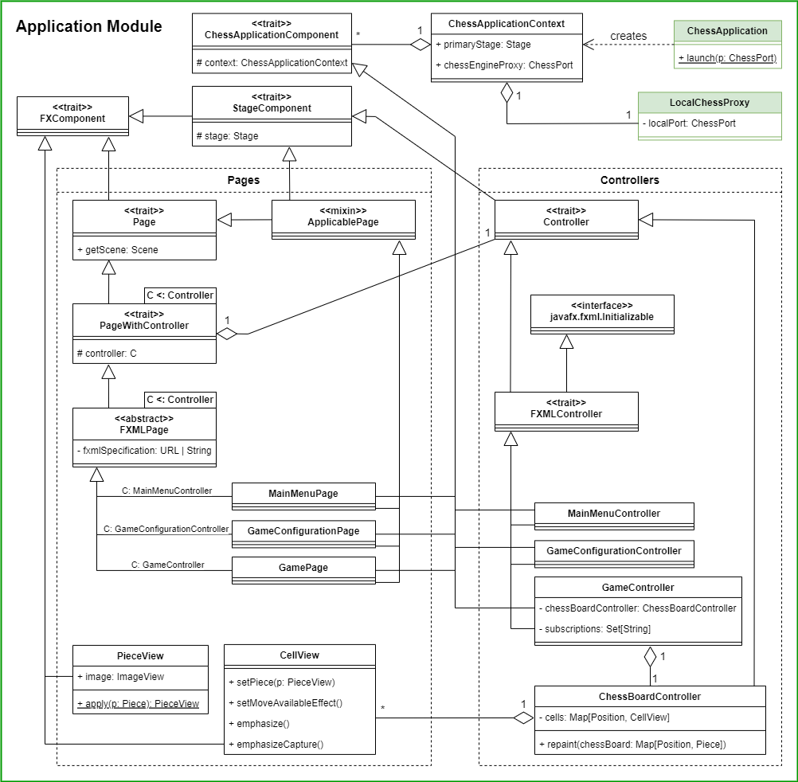
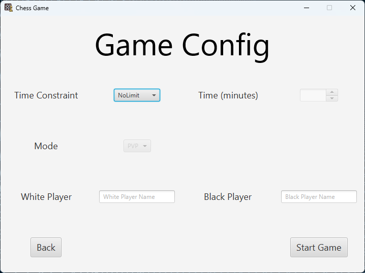
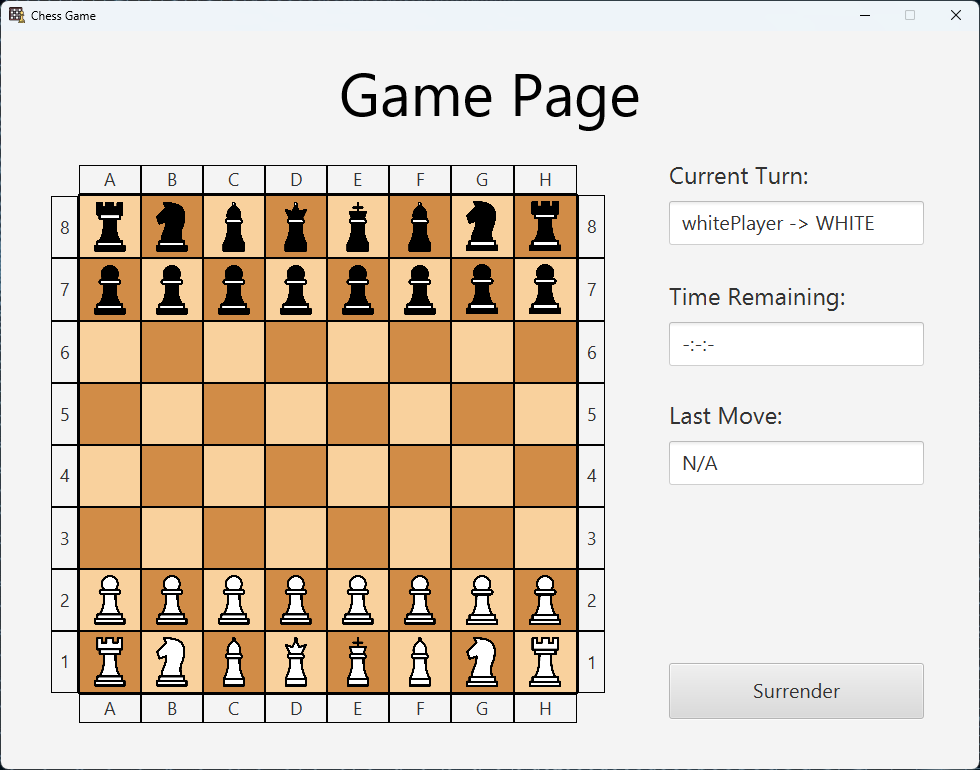
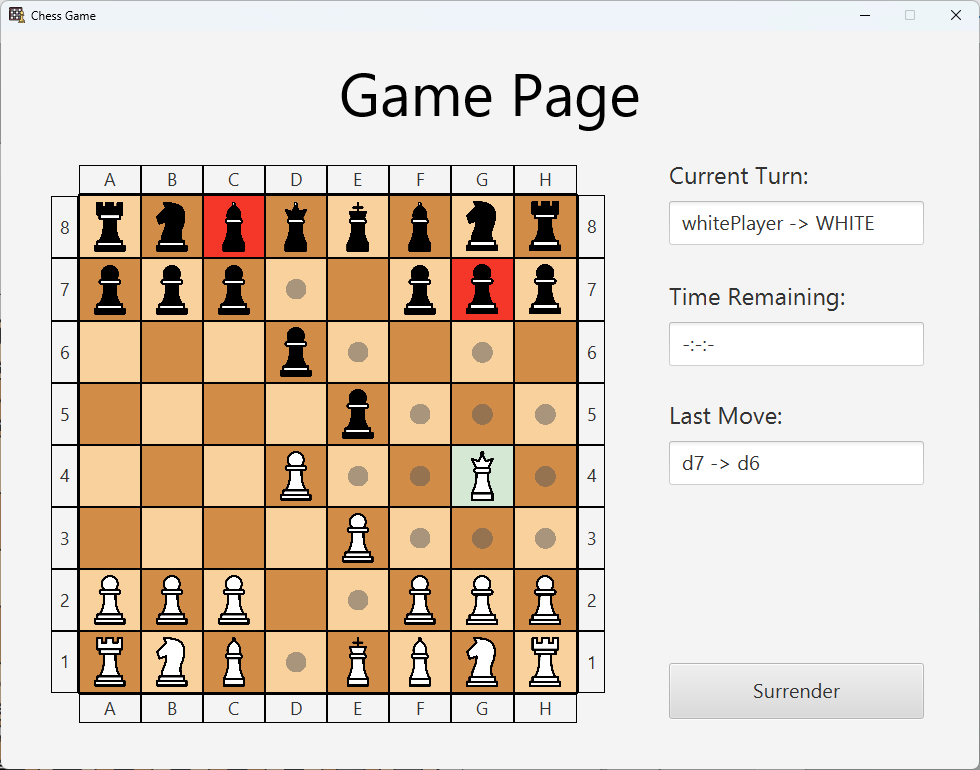
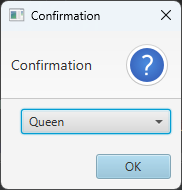
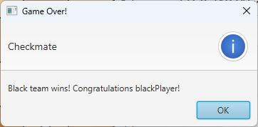

# Design di dettaglio

Come spiegato precedentemente, il sistema rappresentato in figura è suddiviso in due moduli:
- Engine Module: contiene l'implementazione del servizio relativo all'engine.
- Application Module: contiene l'implementazione dell'applicazione.

Come si vede in figura, l'_Application Module_ dipende dall'_Engine Module_, in particolare utilizza
un `LocalChessProxy` per comunicare con un `LocalChessAdapter` messo a disposizione dall'engine.

Da notare come queste due classi per la comunicazione siano solo fittizie, in quanto il servizio e
l'applicazione vengono eseguiti sulla stessa macchina.

Prima di spiegare dettagliatamente i due moduli è bene elencare le diverse tecnologie utilizzate.

## Tecnologie utilizzate

Oltre a quelle obbligatorie citate nei requisiti, sono state scelte ulteriori tecnologie per scopi ben precisi:
- **_Vert.x_**: toolkit utilizzato allo scopo di rendere l'engine reattivo e asincrono.
- _**ScalaFX**_: framework d'interfaccia grafica per sviluppare schermate in maniera facile, grazie all'utilizzo di
  _FXML_.
- **_TuProlog_**: framework per la programmazione logica, al fine d'implementare alcune regole tramite _Prolog_ e
  utilizzarle all'interno dell'applicativo.

Inoltre, altre due tecnologie sono state utilizzate per effettuare il _testing_ del sistema:
- **_ScalaTest_**: tool per lo sviluppo di test in _Scala_.
- **_Awaitility_**: _DSL_ che permette di attendere una computazione per effettuare controlli solo
  dopo un determinato lasso di tempo.

Infine, grazie alla **_SCoverage_** è possibile conoscere in maniera approssimativa la quantità di codice verificato.\
Ovviamente questo non dà una certezza assoluta di mancanza di _bug_, però permette di essere relativamente sicuri
sul codice coperto dalla _coverage_.\
Volontariamente, per mancanze di tempistiche, non sono stati sviluppati test per l'interfaccia grafica.

## Engine Module
Il servizio è stato realizzato attraverso la libreria _Vertx_, che facilita la creazione di sistemi
reattivi a certi eventi.

Di seguito, se ne riporta il diagramma delle classi.

La classe principale di questo modulo è il `ChessService`, il quale permette di avviare il servizio
relativo all'engine, inizializzando i vari `Adapter` e le relative porte del servizio. In particolare,
il `ChessService` è un `Verticle`, per cui è possibile eseguirne il deployment all'interno di un `Vertx`.

Al momento il sistema presenta un unico _Adapter_, il `LocalChessAdapter` che permette solo
interazioni locali con la `ChessPort` relativa al servizio.

La `ChessPort` espone il contratto del servizio come visto nel _Design Architetturale_. Il contratto del servizio 
è stato definito in modo da essere completamente asincrono e non bloccante.

La _ChessPort_ è implementata dalla classe `ChessGame`, che contiene la business logic del servizio e amministra un 
gioco di scacchi, permettendo l'avvio e lo sviluppo di più partite, gestendole una alla volta.

### Avvio della partita

Per poter avviare una partita, è necessaria una configurazione iniziale, modellata dalla classe `GameConfiguration`,
in cui vengono indicate le seguenti informazioni:
- `GameMode`: indica la modalità di gioco di una partita, individuando quindi i tipi di giocatori. Le modalità 
  possibili sono:
  - **PVP**: modalità attualmente implementata, che consiste nella sfida tra due giocatori reali.
  - **PVE**: modalità non implementata, che invece consiste in una sfida tra giocatore reale e computer.
- `TimeConstraint`: indica il vincolo temporale impostato per la partita. Esso può essere:
  - **NoLimit**: indica l'assenza di vincolo temporale.
  - **MoveLimit**: indica il vincolo temporale di limite di tempo per mossa.
  - **PlayerLimit**: indica il vincolo temporale di limite di tempo per giocatore, distribuito su tutte le mosse di 
    quest'ultimo.
- `Player`: indica uno dei due giocatori della partita, identificato dal proprio nome e dal _Team_ di appartenenza.

Nel caso di una partita con limiti di tempo, l'engine delega al `TimerManager` la gestione del vincolo temporale.

### Ottenimento dello stato del gioco corrente

In ogni momento, è possibile ottenere lo stato della partita modellato dalla enumerazione `ChessGameState`, che
definisce i valori **NotConfigured**, **Running** e **AwaitingPromotion** come possibili stati della partita, 
rispecchiando quelli identificati durante la fase di design architetturale. 

Nel caso in cui la partita sia configurata, il suo stato comprende anche un `ChessGameStatus` che permette di accedere 
alle seguenti informazioni:
- `ChessBoard`: rappresenta la scacchiera contenente la disposizione di tutti i pezzi del gioco.
- `ChessGameHistory`: rappresenta lo storico delle mosse, in particolare permette anche di ottenere le mosse specifiche 
  per un pezzo.
- `Team`: rappresenta la squadra **White** o **Black**. In questo caso viene utilizzata per rappresentare la squadra di
  turno.
- `GameConfiguration`: rappresenta la configurazione della partita.

Una `ChessBoard` contiene un insieme di caselle, modellate dalla classe `Position`, identificate da un `File` e da 
un `Rank`, a cui sono associati dei `Piece`.
I _Piece_ possono essere di vario tipo: `Queen`, `King`, `Rook`, `Knight`, `Bishop` e `Pawn`.
Questi sono caratterizzati da un _Team_ di appartenenza e da una propria regola di movimento, modellata da una 
`ChessRule`.
Quest'ultima offre la possibilità di ritrovamento di mosse disponibili, a partire da una posizione data e dallo 
stato del gioco.

### Ottenimento delle possibili mosse di un pezzo

A partita avviata, è possibile ottenere l'insieme delle mosse disponibili da una specifica posizione.

Il ritrovamento delle mosse per ogni pezzo è possibile grazie alla presenza dell'insieme di regole a loro associate.
Queste regole sono strutturate in maniera "modulare", che permette l'assemblaggio di mosse specifiche a partire da 
quelle più generali.
Di seguito è fornito il diagramma che mostra i legami che esistono tra le regole attualmente presenti.

Come si può osservare, la maggior parte delle dipendenze è di _estensione_/_realizzazione_, il che permette di avere 
regole generali, che mano a mano diventano più specifiche, rendendo possibile un eventuale riutilizzo.

È importante notare come tutte le classi d'interfaccia nel diagramma, esclusa l'interfaccia principale `ChessRule`, 
sono effettivamente dei _mixin_, che permettono di limitare o trasformare le mosse secondo una particolare logica.
Ad esempio, il _mixin_ `AvoidAlliesRule` permette di limitare le mosse trovate, per escludere quelle che causerebbero 
la cattura di un pezzo alleato.

Per dare una maggiore enfasi al fatto che i pezzi si muovono secondo delle specifiche **regole**, è stato deciso
d'implementare le regole più semplici utilizzando il linguaggio **Prolog**. Tali regole sono state portate in scala
attraverso l'interfaccia `PrologRule`.
In particolare, è state sviluppata in _Prolog_ la parte delle regole relativa al ritrovamento delle posizioni 
nelle singole direzioni, ad esempio, la `NPrologRule` si occupa di ritrovare tutte le posizioni a nord di un pezzo.
Queste posizioni vengono successivamente analizzate per limitarle alle posizioni all'interno della scacchiera,
attraverso i mixin `InsideBoardRule` o `InsideBoardFilterRule`. Infine, esse vengono processate dalle `ChessRule` per
ottenere solo le mosse accettabili di un certo pezzo.

Una mossa è rappresentata dalla classe `Move`, la quale contiene la _Position_ di partenza e quella di arrivo.
Inoltre, sono presenti altri tipi di mosse più specifiche che estendono _Move_:
- `CaptureMove`: modella la cattura di un pezzo. Rispetto alla _Move_, contiene anche il pezzo catturato.
- `CastlingMove`: modella l'_Arrocco_, perciò necessita della posizione di partenza e arrivo della torre 
  da spostare.
- `DoubleMove`: modella la _Mossa Doppia_ del pedone.
- `EnPassantMove`: modella la _Presa al varco_, contenente anche la posizione del pedone catturato.

### Applicazione di una mossa

In seguito all'ottenimento delle mosse, l'engine permette di applicare una mossa.
Al termine dell'applicazione della mossa, l'engine controlla la scacchiera delegando l'analisi al `ChessGameAnalyzer`,
il quale è in grado di riconoscere le varie situazioni di scacco, stallo, scatto matto o promozione.

### Promozione

Ulteriori dettagli implementativi verranno spiegati nella documentazione specifica di Felice Mirko.

### Resa

A partita avviata, il sistema permette al giocatore di turno di arrendersi, terminando la partita e
generando un opportuno `GameOverEvent`.

### Sottoscrizione agli eventi

In ogni momento, è possibile sottoscriversi ai diversi eventi dell'engine, ricevendoli quando sono generati e
quindi potendo reagire di conseguenza.
I tipi di eventi che vengono generati estendono la classe `Event` e sono:
- `GameOverEvent`: evento generato quando la partita è terminata per qualsiasi motivo. Esso contiene la causa del
  termine della partita, modellata dalla classe `GameOverCause` e opzionalmente il vincitore.
- `BoardChangedEvent`: evento generato quando la scacchiera è stata modificata, ossia quando un pezzo viene mosso o
  quando viene completata la promozione di un pedone.
- `TurnChangedEvent`: evento generato quando il controllo della scacchiera passa a un altro giocatore. Esso informa
  l'utente di quale sia il giocatore che ha il controllo della scacchiera.
- `PromotingPawnEvent`: evento generato quando un pedone deve essere promosso, informando della sua posizione e dei
  pezzi in cui esso può essere promosso. Quest'ultimo concetto viene modellato dalla classe `PromotionPiece`.
- `TimePassedEvent`: evento generato ogni secondo, nel caso la partita sia stata impostata con un vincolo temporale.
  Esso informa del tempo rimasto al giocatore corrente.
- `CheckNotificationEvent`: evento generato quando si individua una situazione di scacco sulla scacchiera. Esso
  informa l'utente di quale sia il giocatore che è stato messo in scacco.

## Application Module
L'applicazione è stata realizzata utilizzando la libreria _ScalaFX_, la quale è un wrapper di _JavaFX_ che permette
di realizzare semplici interfacce grafiche molto velocemente, sfruttando la dichiaratività di Scala. 

Di seguito, se ne riporta il diagramma delle classi.

La classe principale di questo modulo è `ChessApplication`, che permette di avviare l'interfaccia grafica fornendole
il proxy per comunicare con l'engine, modellato dalla classe `LocalChessProxy`.

L'applicazione è composta da diversi componenti modellati dalla classe `ChessApplicationComponent` a cui viene fornito
il contesto dell'applicazione, modellato dalla classe `ChessApplicationContext`, la quale permette di accedere da una 
parte allo _Stage_ primario dell'applicazione e dall'altra al proxy.

Un `FXComponent` è un componente che ha accesso alle funzionalità implicite di ScalaFX.\
Uno `StageComponent` è un _FXComponent_ che gestisce un proprio _Stage_ (eventualmente non quello primario).

Esistono due tipi principali di _FXComponent_:
- `Page`: gestisce la visualizzazione di una schermata dell'applicazione.\
  In particolare, una `PageWithController` è una _Page_ a cui è associato un certo _Controller_.
  Un tipo di particolare di _PageWithController_ è una `FXMLPage`, la cui rappresentazione grafica è definita da un
  file in formato _.fxml_.\
  Una _Page_ permette di ottenere la propria rappresentazione grafica e di applicarla successivamente a un certo
  _Stage_ dell'applicazione. Diversamente, una `ApplicablePage` richiede uno _Stage_ quando creata e viene applicata
  istantaneamente.
- `Controller`: gestisce la logica d'interazione con un certo componente grafico dell'applicazione.\
  Un tipo particolare di _Controller_ è un `FXMLController` che estende l'interfaccia `Initializable` di ScalaFX, 
  permettendo al componente che carica i file fxml d'inizializzarlo in autonomia.

Di seguito, si presentano le cinque schermate dell'applicazione.

### Main Menu Page
Modellata dalla classe `MainMenuPage`, rappresenta la pagina iniziale ed è controllata dal `MainMenuController`.  

### Game Configuration Page
Modellata dalla classe `GameConfigurationPage`, rappresenta la pagina di configurazione di una partita ed è controllata
dal `GameConfigurationController`.  
  

### Game Page
Modellata dalla classe `GamePage`, rappresenta la pagina in cui si sviluppa una partita ed è controllata dal 
`GameController`. 

In particolare la scacchiera è composta da un insieme di `CellView` ed è controllata dal `ChessBoardController`.
La rappresentazione grafica di ciascuno dei pezzi sulla scacchiera è gestita dalla classe `PieceView`.  

Alla creazione, il `GameController` si sottoscrive agli eventi dell'engine e aggiorna lo stato visualizzato della
partita, in relazione agli eventi ricevuti.

### Promotion Dialog
Rappresentato attraverso un `Dialog` di ScalaFX.

### Result Dialog
Rappresentato attraverso un `Dialog` di ScalaFX.

[Back to index](../index.md) |
[Previous Chapter](../4-architectural-design/index.md) |
[Next Chapter](../6-implementation/index.md)
