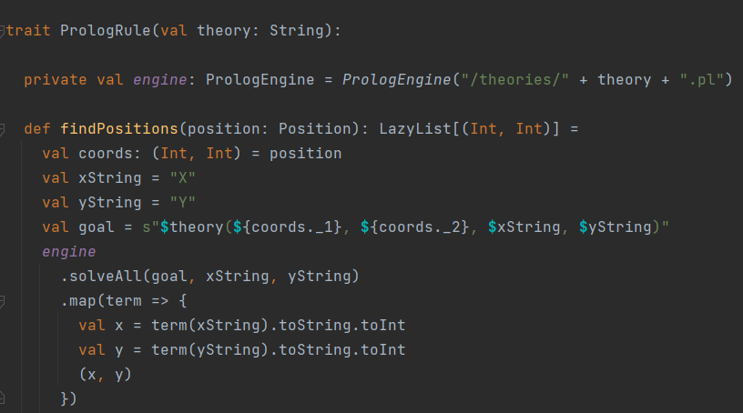

# Implementazione
In questa sezione, ogni membro del team entrerà nel dettaglio di alcune tra le principali componenti del sistema che ha
realizzato.

Dapprima vengono però descritte alcune funzionalità sviluppate in comune (_pair programming_).

## Pair Programming

### PrologEngine

Componente sviluppato da _Derevyanchenko Maxim_ e _Felice Mirko_.

Per utilizzare le regole _Prolog_ all'interno di Scala c'è bisogno d'integrare le funzionalità presenti nel framework
_TuProlog_.\
A questo proposito è stato pensato di creare un `PrologEngine` come un agente che permetta di risolvere i _goal_ 
relativi a delle teorie _Prolog_.

### PrologRule

Componente sviluppato da _Derevyanchenko Maxim_ e _Felice Mirko_.

Si è deciso che ogni regola Prolog debba avere il suo corrispettivo file Scala, estendendo il trait `PrologRule`.

Come si osserva in figura, è stato creato il _trait_ _PrologRule_, che implementa una modalità d'interazione con 
una teoria _Prolog_ che sia strutturata nella maniera specificata a breve.
Questo è effettuabile, fornendo alla classe il nome del file contenente la teoria in questione, con la quale sarà 
generato il relativo engine. \
Esso deve seguire quindi una struttura tale che il nome del predicato debba corrispondere al 
nome del file. Inoltre, le regole non sono utilizzabili come _fully relational_, in quanto esse devono possedere quattro
termini, di cui i primi due saranno utilizzati come input, mentre gli ultimi due come output.

L'interazione con la teoria è rappresentata dal metodo `findPositions`, che ha lo scopo di ottenere una lista di 
posizioni di destinazione, a partire da una specifica posizione data.
Questo metodo infatti riesce a costruire il _goal_ relativo alla richiesta dell'utente e successivamente trasformare 
il risultato della computazione in una _LazyList_ di tutte le soluzioni.

In seguito sono state quindi sviluppate le regole di movimento diagonali per ciascuna direzione, ossia direzione 
nord-ovest, nord-est, sud-ovest, sud-est.
Ciascuna di queste segue una logica generale per cui ricorsivamente viene calcolata la prossima posizione in base
alla propria direzione, incrementando di uno l'_offset_.

Queste sono state pensate più generiche possibili perciò calcolano le soluzioni all'infinito nella specifica direzione.
Per questo motivo si è sviluppato anche un _mixin_ `InsideBoardRule` allo scopo di limitare le posizioni a quelle 
interne alla scacchiera.

### Altro

Altre classi sviluppate da _Derevyanchenko Maxim_ e _Felice Mirko_ sono: `Move` e `Piece`.

## Cesario Jahrim Gabriele

## [Derevyanchenko Maxim](maxim/maxim.md)

## [Felice Mirko](mirko/mirko.md)

## Kentpayeva Madina

[Back to index](../index.md) |
[Previous Chapter](../5-detailed-design/index.md) |
[Next Chapter](../7-conclusion/index.md)