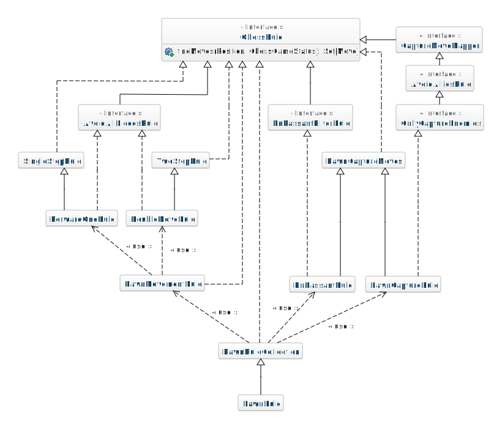
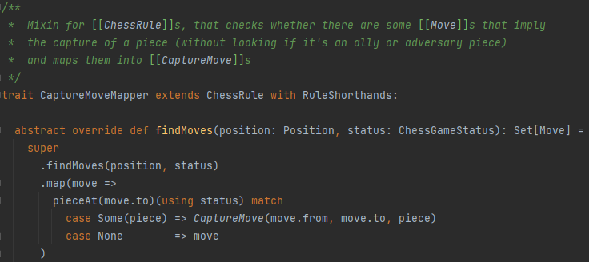
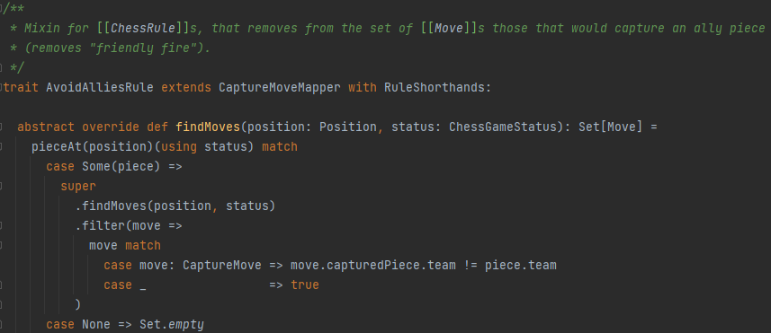
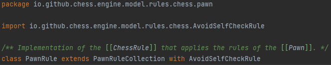

Nel progetto si possono individuare diversi componenti che sono stati implementati individualmente e in collaborazione 
con gli altri membri, grazie al fatto che sono state effettuate delle suddivisioni dinamiche dei task per ogni _Sprint_.

Tra i componenti implementati individualmente da me, si possono osservare:
- Le regole di movimento e di cattura del pedone, per il ritrovamento di tutte le mosse disponibili all'utente 
  durante il suo turno. Tra queste si possono osservare specificatamente: `AvoidAlliesRule`, `AvoidAllPiecesRule`, 
  `OnlyCaptureEnemies`, e tutte le regole contenute nel package `engine.model.rules.chess.pawn`;
- I tipi di mosse relative direttamente al pedone. Questo include le mosse specifiche, che non vengono effettuate dagli
  altri tipi di pezzi del gioco, ovvero:
  - `DoubleMove`, che rappresenta la mossa che effettua il doppio passo in avanti, disponibile alla prima mossa di ogni 
    pedone;
  - `EnPassantMove`, una mossa di cattura speciale che può essere effettuata esclusivamente da un pedone,
    per catturare un pedone avversario;
- `Pawn`, la classe specifica del Pawn;
- `Team`, che rappresenta le due squadre di cui il gioco degli scacchi è composto: bianchi e neri;
- Le regole prolog relative alla cattura pedone, per ritrovare le mosse con cui un pedone può catturare.
  Queste sono suddivise in `WhitePawnCaptureRule` e `BlackPawnCaptureRule`, a causa del fatto che i pedoni di squadre 
  diverse si muovono in direzioni opposte. È anche presente il mixin `InsideBoardFilterRule`, che scarta le posizioni 
  che ricadono all'esterno della board;
- `PieceMovedEvent` (attualmente `BoardChangedEvent`), evento che viene attivato quando viene effettuata una modifica 
  alla board, principalmente, lo spostamento di un pezzo;

I file invece implementati in collaborazione con gli altri membri del team includono:
- `ChessBoard`, di cui ho implementato una versione di partenza;
- _Rule_ di altri pezzi per implementare una modalità di ritrovamento delle mosse di cattura comune;
- `GameController`, per il quale ho aggiunto l'aggiornamento dei componenti grafici alla ricezione dell'evento
  `PieceMovedEvent`;
- `ChessBoardController`, aggiungendo verifiche per risolvere delle problematiche relative alla selezione dei pezzi 
  del team avversario.

## Pawn Rules

Le regole del pedone sono strutturate in una gerarchia ampia ma semplice, rappresentate dal seguente diagramma:

Questo è possibile per il fatto che le mosse di un pedone sono definite da quattro regole molto semplici, che sono in 
grado 
di ottenere non più di due mosse individualmente.
Queste regole sono:
- Mossa di un passo in avanti (`ForwardOneRule`): la mossa principale del pedone che gli permette di avanzare. Essa 
  è disponibile sempre, a meno che la posizione di destinazione non sia già occupata da un altro pezzo;
- Mossa di due caselle in avanti, denominata nel progetto come _mossa doppia_ (`DoubleMoveRule`): questa è la mossa 
  effettuabile dal pedone, esclusivamente come suo primo spostamento;
- Cattura (`PawnCaptureRule`): il pedone è l'unico pezzo degli scacchi che possiede la regola di cattura che è 
  completamente separata dalla sua logica di movimento. La sua modalità di cattura perciò richiede che il nemico sia 
  posizionato nella casella più vicina nelle due direzioni diagonali, che gli permettono di avanzare. Infatti il pedone 
  non può mai catturare effettuando il suo movimento base, diversamente da tutti gli altri pezzi. Analogamente non 
  si può mai semplicemente spostare seguendo la sua regola di cattura;
- _Presa al varco_ (`EnPassantRule`): disponibile solo nel caso specifico, in cui un pedone avversario, in seguito 
  all'effettuazione di una mossa doppia, finisce sulla casella adiacente al pedone. Quest'ultimo, in tal caso, potrà 
  effettuare la cattura seguendo la sua regola di cattura, posizionandosi sulla casella che il pedone avversario ha 
  "saltato", catturandolo.

Queste regole sono tutte dipendenti dalle regole più semplici, incaricate a trovare esclusivamente le mosse 
effettuabili, che successivamente vengono analizzate ed eventualmente limitate da uno specifico **mixin**.

I **mixin** in questione sono:
- `AvoidAllPiecesRule`, utilizzabile dalle mosse di spostamento che non comportano la cattura, dato che tali mosse non 
  possono essere effettuate, a meno che la casella di destinazione non sia completamente libera. Il _mixin_ infatti 
  rimuove tutte le mosse che finirebbero su un altro pezzo;
- `OnlyCaptureEnemies`, utilizzato per l'analisi delle mosse di esclusiva cattura, che possono essere effettuate 
  solo se la casella di destinazione contiene un pezzo avversario. Questo mixin estende altri due, che aiutano a 
  processare le regole di cattura anche per gli altri pezzi degli scacchi e saranno descritti successivamente;
- `EnPassantFilterRule`, che svolge l'analisi per determinare se la _presa al varco_ sia effettuabile.

Le altre regole presenti possono essere suddivise in due gruppi:
- Regole del ritrovamento semplice delle mosse, che non effettuano nessun analisi sull'effettiva disponibilità di tali 
  mosse. Queste comprendono `SingleStepRule`,`TwoStepRule` e`PawnCaptureMoves`.
- Regole che raggruppano altre regole semanticamente e includono `PawnMovementRule` e `PawnRuleCollection`. 
  Quest'ultima comprende tutte le regole del pedone ed è a sua volta estesa dalla regola definitiva del pezzo, 
  `PawnRule`.

## Logica di cattura

Inizialmente la logica di cattura era definita indipendentemente per ogni pezzo.
Questo era necessario poiché alcune regole hanno una logica di movimento che richiede ulteriori analisi per 
verificare la disponibilità delle mosse.
In particolare l'_Alfiere_, la _Torre_ e la _Regina_, muovendosi in un insieme di direzioni, presentano la necessità 
di evitare gli ostacoli.
Infatti, quando uno di questi pezzi incontra un pezzo sul suo percorso, tutte le posizioni successive non saranno 
accessibili.

Gli altri tre tipi di pezzi, invece, possiedono le mosse base che comportano lo spostamento di una sola posizione 
(_Pedone_, _Re_) oppure quelle che non sono influenzate dai pezzi che si trovano nelle posizioni intermedie 
(_Cavallo_). 
Questo rende il ritrovamento per il secondo gruppo molto più semplice.

In una versione iniziale infatti, l'analisi per il ritrovamento delle mosse di cattura per i pezzi di Alfiere, Torre e 
Regina era inclusa nel ritrovamento delle le mosse, il che era estremamente specifico a quel tipo di spostamento.

Successivamente, ho semplificato quest'analisi, restringendola a una semplice rimozione di tutte le posizioni 
che finiscono dietro a un eventuale ostacolo, mantenendo l'ostacolo tra le posizioni accettabili.

A questo punto, tutti i pezzi possono essere analizzati in maniera analoga, dato che le uniche mosse non accettabili 
a questo punto saranno solo quelle che comporteranno la cattura del pezzo alleato.

Per aggiungere quest'ultima funzionalità è stato realizzato il _mixin_ `AvoidAlliesRule`.
Questo _mixin_ estende a sua volta il `CaptureMoveMapper`, il quale analizza tutte le mosse ed eventualmente 
trasforma, quelle che finiscono su un qualsiasi pezzo, in _mosse di cattura_:

A questo punto, l'analisi di `AvoidAlliesRule` diventa molto semplice, dato che sarà necessario scartare solo le 
mosse di cattura, che comporteranno la cattura di un pezzo alleato:

Questa separazione e l'utilizzo dei _mixin_ rendono l'assemblaggio delle regole estremamente semplice e aiutano a 
mantenere il contenuto delle classi finali estremamente pulito.
Ad esempio la regola del **Pedone** può essere definita semplicemente da questo codice:

## Eventi

Per aggiornare le informazioni contenute nell'interfaccia grafica era necessario mettere in comunicazione il modello 
e l'interfaccia. 
In particolare bisognava informare l'interfaccia grafica delle modifiche apportate all'engine del gioco.

Per questo motivo ho implementato una versione iniziale della logica degli eventi, specificatamente, quella relativa 
all'effettuazione di una mossa.
Questo evento è attualmente rappresentato dal trait `BoardChangedEvent`, contenente i dati relativi a: la disposizione 
dei pezzi sulla scacchiera, il team che è attualmente di turno (successivamente modificato nel giocatore di turno) 
e l'ultima mossa effettuata.

Grazie a questi dati, l'interfaccia può essere aggiornata, informando l'utente dello stato in cui si trova la 
partita, compresa di tutte le informazioni necessarie.

## Regole Prolog del pedone

Per dare una maggiore enfasi al fatto che le mosse effettuabili da un pedone sono definite da un insieme di regole, 
ho scelto d'implementare anche le regole di cattura del pedone nel linguaggio **Prolog**.

Perciò sono stati definiti due file _Prolog_, uno per il pedone del team bianco e uno per il team nero, per 
rispettare il fatto che i due pedoni si spostano in direzioni opposte.

Successivamente tali posizioni sono filtrate per rimuovere quelle che finirebbero al di fuori dei limiti della 
scacchiera.
Per fare ciò, è stato definito il _mixin_ `InsideBoardFilterRule`, che prende tutte le posizioni ritrovate da una 
regola prolog ed esegue la `filter` per rimuovere tutte quelle che non apparterrebbero alla scacchiera.
Infine il risultato viene analizzato dal `PawnCaptureMoves` per mantenere esclusivamente le mosse accettabili.
