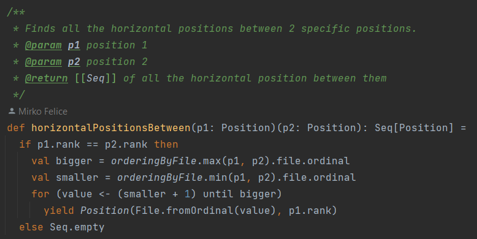
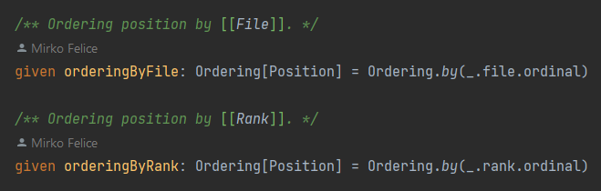
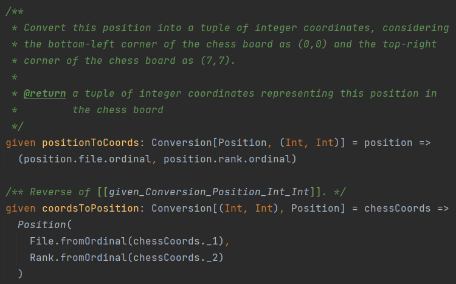
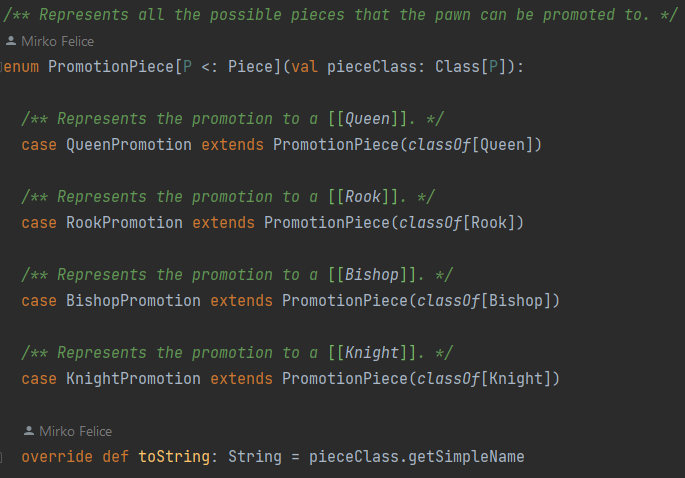
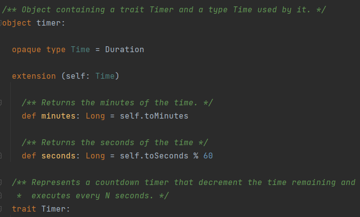
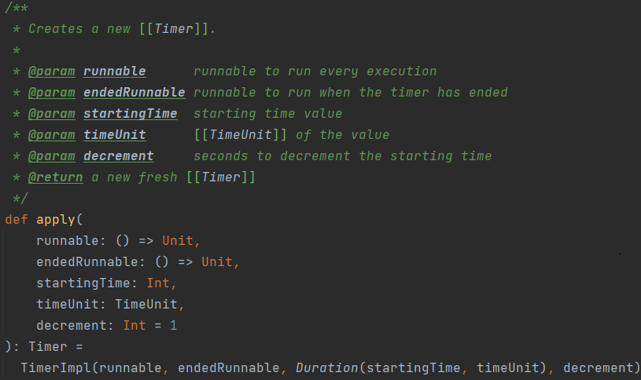
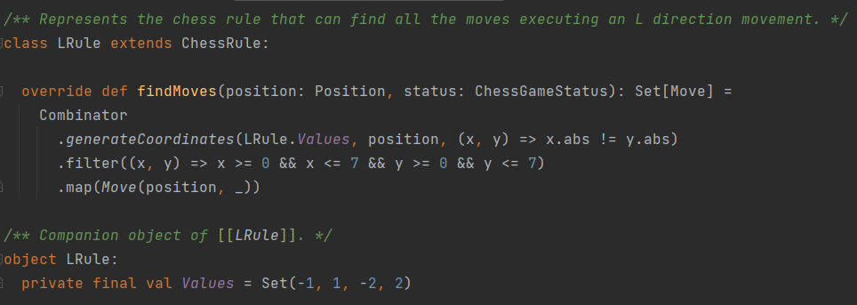
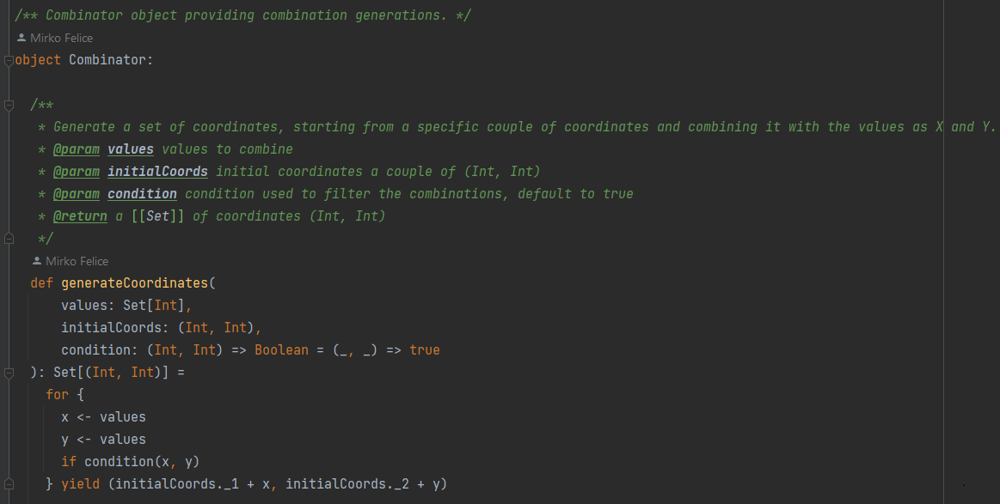

Durante gli Sprint il lavoro è stato cercato di essere suddiviso il più possibile. Nel complesso
è stato sviluppato codice completamente da parte mia, mentre altre parti sono state sviluppate in cooperazione.

I file completamente attribuili al sottoscritto sono: `Position`, `File`, `Rank`, `OutsideBoardException`,
`PromotingPawnEvent`, `PromotionPiece`, `GameConfiguration`, `Player`, `WhitePlayer`, `BlackPlayer`,
`GameMode`, `TimeConstraint`, `timer`, `TimerManager`, `TimePassedEvent`, `Combinator`,  `CastlingRule`, `CastlingMove`.

Altri file a cui ho collaborato sono: `GameConfigurationController` modificato per quanto 
riguarda il vero e proprio sviluppo delle funzionalità grafiche, ma senza necessità di crearla da zero grazie alla 
struttura base sviluppata da altri membri del gruppo, `ChessGame` per quanto riguarda lo sviluppo della promozione, 
della logica relativa alla gestione del tempo, `ChessBoardController` per quanto riguarda l'evidenziamento della 
mossa di cattura, `LRule` e `KnightRule` solo per quanto riguarda il movimento del cavallo, `DiagonalRule` e 
`BishopRule` solo per quanto riguarda il movimento dell'alfiere, `AllDirectionsOneStepRule`, `KingMovementRule`, 
`KingRuleCollection` e `KingRule`, solo per quanto riguarda il movimento del re.

Per meglio rappresentare il codice sviluppato, si possono raggruppare i file per gruppi di funzionalità.

## Configurazione della partita 

La configurazione della partita è stata sviluppata in realtà in maniera basilare poiché essa rappresenta
solamente un insieme d'informazioni.
Difatti essa contiene `GameMode`, due `Player`, obbligatoriamente uno bianco e uno nero, e un `TimeConstraint`.

Per obbligare alla formazione di due giocatori di squadre diverse, sono stati implementati solo due casi specifici 
diversi: `WhitePlayer` e `BlackPlayer`, ciascuno dei quali sovrascrive la squadra del trait _Player_ con il 
corrispettivo _Team_ (**WHITE** e **BLACK**).

Si può andare in maniera più dettagliata anche per quanto riguarda il _TimeConstraint_.
Infatti questa è stata implementata come **_enum_**, ma a ciascuno di questi _case_ viene associato un valore numerico 
rappresentante il tempo in minuti. \
Inoltre sono stati associati dei valori di _default_ e dei valori di minimo e massimo per ciascun tipo di modalità a 
tempo che non siano quella indicante l'assenza di limite temporale. Tali valori sono stati creati per permettere
all'utente di scegliere dei valori adeguati alla modalità di tempo scelta.

## Cella

Un concetto importante da sviluppare per quanto riguarda la scacchiera è il concetto di cella.

Questa è stata modellata come una classe `Position` identificata dal proprio `File` e dal proprio `Rank`, 
implementati come enumerazioni (_**enum**_) in quanto i valori sono e saranno sempre e solo quelli (da A a H per i _File_
e da 1 a 8 per i _Rank_).

### File/Rank

Una logica non citata in precedenza è la possibilità di avanzare o indietreggiare di un _File_ o di
aumentare o diminuire di un _Rank_ rispetto alla cella attuale, implementata sviluppando le rispettive 
funzionalità all'interno di _Rank_ (`up()` e `down()`) e _File_ (`forward()` e `backward()`) utilizzando
l'idiomatico _**pattern matching**_.

Inoltre, per rappresentare il concetto di limite della scacchiera è stata modellata un'eccezione 
`OutsideBoardException`, la quale viene lanciata nel momento in cui si tenta ad aumentare il già massimo _Rank 8_ o
di diminuire il già minimo _Rank 1_.
Analogamente succede per quanto riguarda il _File_.

Poi, per cercare di adeguare la rappresentazione testuale al protocollo _Universal Chess Interface(UCI)_
è stato sovrascritto il metodo `toString()`.

### Position

Il file si compone di due strutture: _trait_ e corrispettivo _companion object_.

Il _Trait_ rappresenta il contratto dell'oggetto, per definire tutte le funzionalità che possono essere utilizzate
esternamente.

Il _companion object_ invece è stato utilizzato per diverse ragioni.
Prima di tutto per rendere la costruzione dell'oggetto _Position_ pulita per l'utilizzatore:
definendo infatti il metodo `apply()` è possibile costruire un oggetto senza mostrare la mera implementazione.
Questo pattern è stato ampiamente utilizzato in tutto il codice sviluppato.
\
Es. _Position(File.A, Rank.\_1)_

Oltre a ciò il _companion object_ contiene la definizione di una funzionalità che permette di trovare 
tutte le celle orizzontalmente presenti tra due celle di partenza. 
Questa funzionalità è necessaria per controlli relativi alla regola dell'_arrocco_.

Come si vede in figura, per permetterne un possibile riuso parziale il metodo è stato definito in **_currying_**.
In questa maniera è possibile riutilizzare la funzione parzialmente applicata: un uso effettivo è infatti stato
implementato proprio nella regola dell'arrocco per non rieseguire in maniera completa la funzione in quanto la 
cella del re rimane esattamente la stessa all'interno del metodo.

Inoltre, al suo interno, è stato utilizzato un ordinamento per _File_ per trovare in maniera esplicita il massimo e il 
minimo tra i due valori.
Per esportare esternamente questa funzionalità e per dare la possibilità di utilizzare anche un ordinamento per Rank, 
sono stati creati i corrispettivi **_given Ordering_**.

Infine, per aiutare in diverse situazioni la costruzione e decostruzione degli oggetti di _Position_, sono stati
create due conversioni implicite, tramite **_given Conversion_**, per trasformare una coppia di coordinate intere a 
_Position_ e viceversa.
\
Es. _(0, 0) => Position(File.A, Rank.\_1)_

## Promozione

Per sviluppare la funzionalità di promozione, sono state necessarie due classi aggiuntive.

Difatti, prima di poter effettuare una promozione, l'engine deve avvisare l'utente che il pedone si trovi
nella cella corretta.\
Per questo motivo, nel momento di applicazione della mossa, viene eseguita un'analisi per verificare che nella
cella di arrivo sia ora presente un pedone, e che esso abbia raggiunto la base nemica (_Rank_ 8 per i bianchi, 
_Rank_ 1 per i neri).\
A questo punto, in caso positivo viene pubblicato l'evento appropriato.

### PromotingPawnEvent

Questa classe rappresenta tale evento. 
Essa contiene infatti due informazioni necessarie all'applicativo: la cella attuale del pedone e
l'insieme dei pezzi in cui poter promuovere il pedone stesso.

La cella è necessaria per far capire all'engine quale pezzo deve sostituire, mentre l'insieme dei pezzi
serve all'interfaccia grafica per permettere di far scegliere all'utente in quale pezzo effettuare la promozione.

Inoltre, sempre per nascondere l'implementazione all'utilizzatore, la classe viene fornita di un _companion object_ 
capace di costruire l'oggetto.

### PromotionPiece

Siccome in realtà l'utente deve sapere solo il tipo del pezzo in cui promuoversi e siccome tali tipi
sono stabili, è stato scelto di costruire un'enumerazione che rappresenti tale concetto.

Come si vede nella figura seguente, ciascuno di questi contiene il _Class_ relativo al pezzo rappresentato.
In questa maniera, da parte dell'engine viene sfruttata la _reflection_ per costruire una nuova istanza del tipo di 
pezzo scelto.

Inoltre, per evidenziare il fatto che le classi debbano essere relative a dei pezzi di gioco, è stato
inserito un cosiddetto **_Upper Type Bound_** che permette di vincolare i tipi della _Class_ solo a sottotipi
del tipo inserito: in questo caso `[P <: Piece]`.

Di conseguenza per permettere all'engine di adattarsi, è necessario creare il metodo in maniera 
specifica, definendolo _**polymorphic**_ poiché esso riceve un parametro di un tipo non definito esplicitamente. 
Infatti il metodo ha questa _signature_:
`def promote[P <: Piece](pawnPosition: Position, promotingPiece: PromotionPiece[P]): Future[Unit]`.

## Gestione del tempo

Una partita può essere configurata indicando dei vincoli temporali.
È quindi necessario gestire il tempo nell'engine, a seconda della modalità scelta.

Innanzitutto per avvertire l'utente che il tempo sta passando, è stato creato un evento apposito:
`TimePassedEvent`, contenente il tempo rimanente.

Per astrarre questo concetto di tempo dalla mera implementazione interna, è stato scelto di creare un nuovo tipo:
**_opaque type Time_** al quale aggiungere tramite _**extension method**_ le funzionalità necessarie.
Renderlo opaco infatti permette di non poter visualizzare l'effettiva implementazione, e quindi le relative 
funzionalità, del tipo scelto.

In questo caso infatti, l'interfaccia grafica ha bisogno di mostrare il tempo rimanente sotto forma di 
minuti e secondi e di conseguenza sono stati creati i metodi appropriati, nascondendo ancora una volta 
l'implementazione.
Per rendere visibili esternamente sia il nuovo _type_ e quindi i relativi metodi, sia il _trait Timer_, è 
stato necessario aggiungere un livello di wrapping in un nuovo _object_.

Per rappresentare il passare del tempo è stato scelto d'implementare un agente in grado di effettuare il
_countdown_ in maniera asincrona.

### Timer

Il contratto di questa classe infatti, permette di effettuare funzionalità classiche di un timer, come `start()`,
`stop()`, `continue()`, `reset()` e `restart()`, oltre alle possibilità di conoscere differenti stati: `ended`, 
`stopped`, `timeRemaining`.

Per rendere il codice estendibile, si è cercato di rendere la classe più generica possibile; infatti non vi è alcuna
dipendenza dal modello.

Per permettere di fare ciò è necessario fare in modo che l'utente possa eseguire quello che vuole.
Questo è possibile utilizzando il pattern _**strategy**_, definendo nel costruttore del _Timer_ parametri come 
funzioni.
Difatti come si osserva nella figura seguente, vengono definiti due parametri come funzioni che verranno utilizzate 
per eseguire codice esterno rispettivamente, a ogni esecuzione e nel momento in cui il _Timer_ esaurisce il tempo 
rimanente.

### TimerManager

Poiché la logica di gestione del tempo è abbastanza complessa e lunga si è deciso di separarla concettualmente in 
una classe a parte.
In effetti tale classe viene utilizzata come se fosse una collezione di `Timer`.\
Lavorando con le classi appena descritte si è pensato d'impostare diversi timer, a seconda del vincolo temporale
impostato per la partita.
\
Infatti, nel caso in cui il limite di tempo sia per mossa, viene impostato un solo timer, il quale viene
continuamente riavviato da capo al termine del turno.
\
Contrariamente nel caso in cui il limite di tempo sia per giocatore, è necessario memorizzarsi il tempo
rimanente di ciascun giocatore, e per far ciò si è optato di usufruire di due timer diversi, uno per ogni
giocatore.
In questa maniera, al termine del turno viene fermato il timer del giocatore di turno corrente e fatto ripartire
quello del giocatore avversario.

## Regole

Le regole sviluppate sono le seguenti.
Occorre far notare che molte classi sono state rifattorizzate in base agli sviluppi accaduti successivamente.
Inoltre, è importante far notare come il sottoscritto abbia sviluppato solo le regole di movimento, che quindi non
includono la relativa parte di cattura di altri pezzi, il cui codice è stato sviluppato da altri membri del gruppo.

### Regola dell'Alfiere

L'alfiere possiede un'unica regola di movimento, quella diagonale.
Per ottenere le mosse quindi questa regola bisogna innanzitutto ottenere le coordinate, sfruttando le regole _prolog_
sviluppate precedentemente.
In seguito basta solo generare le mosse a partire dalla cella iniziale e da quelle ottenute.

### Regola del Cavallo

La regola di movimento del cavallo è molto particolare, poiché segue un movimento ad L.
Al contrario di altri pezzi, questo non sfrutta una generazione di coordinate da un _PrologEngine_.
Viene infatti sfruttata una combinazione dei valori **1,-1,-2,2** tramite una funzionalità che verrà spiegata in 
una sezione successiva.
Inoltre, i valori devono essere limitati a essere interni alla scacchiera e successivamente trasformati in mosse,
come si vede nella figura seguente.

### Regole del Re

Il Re possiede due regole: quella di movimento e quella di arrocco.

#### AllDirectionsOneStepRule

Analogamente a quanto appena spiegato per il cavallo succede per il re, in particolare per la sua regola di movimento.
L'unica differenza è che i valori questa volta sono **0,-1,1**.

#### CastlingRule

Questa regola controlla se sono disponibili mosse di arrocco.
Per eseguire un'arrocco sono necessarie più verifiche: 
- che nella cella data sia presente un pezzo di tipo _King_;
- che il re non abbia ancora effettuato alcuna mossa;
- che nella cella in cui dovrebbe esserci una torre sia effettivamente presente un pezzo di tipo _Rook_;
- che anche questo non abbia effettuato ancora alcuna mossa;
- che nelle celle intermedie tra i due pezzi non sia presente nessun pezzo.

Questo controllo deve essere effettuato in maniera analoga sia per l'eventuale torre ovest, che per quella est.
A questo punto è possibile generare le mosse.

#### CastlingMove

La _CastlingMove_ rappresenta la mossa dell'arrocco, la quale oltre alla cella di partenza e di
arrivo necessita di sapere la cella di partenza e di arrivo della torre da spostare.

## Combinator

Questo _object_ permette di generare nuove coordinate, a partire da una coppia di coordinate (**_tuple_** d'interi) e da un 
insieme di valori, opzionalmente filtrando anche dei valori.

Come si osserva in figura, il codice infatti sfrutta la _**for comprehension**_ di Scala per combinare i 
possibili valori di _X_ e _Y_,
da aggiungere poi alla coppia di coordinate specificata.
Il filtro opzionale viene realizzato mediante un **_default parameter value_**.
